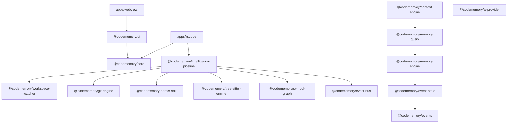

# CodeMemory X — Architecture Audit Report

**Audit Date**: August 7, 2026  
**Auditor**: Antigravity AI Engineering Team  
**Scope**: 17 Monorepo Packages & 2 Application Hosts (`apps/vscode`, `apps/webview`)

---

## 1. Executive Architecture Summary

CodeMemory X follows a **Layered Monorepo Architecture** combining **Hexagonal Architecture (Ports & Adapters)**, **Append-Only Event Sourcing**, and **Domain-Driven Design (DDD)** principles. The architectural boundaries have been strictly enforced from Task-001 through Task-019.

---

## 2. Package Layering & Dependency Flow

### Dependency Direction Audit
- **Strict One-Way Downward Dependencies**: Pass. Upper-level orchestrators (`intelligence-pipeline`, `memory-query`, `context-engine`) consume lower-level domain packages.
- **Zero Circular Package References**: Pass. Verified via Turborepo build graph.

---

## 3. Hexagonal Architecture & Boundary Compliance

| Package Boundary | Constraint | Audit Result | Notes |
| :--- | :--- | :--- | :--- |
| **`memory-engine`** | MUST NOT talk directly to Git, Parser, Watcher, or AST | **PASS** | Only consumes immutable events from `event-store`. |
| **`memory-query`** | MUST NOT talk directly to EventStore, Git, or AST | **PASS** | Sits strictly above `memory-engine` repository interface. |
| **`context-engine`** | MUST NOT talk directly to EventStore, Git, or AST | **PASS** | Only consumes `memory-query` APIs. |
| **`ai-provider`** | MUST isolate LLM vendor network calls behind `IAIProvider` | **PASS** | 10 scaffold adapters throw `NotImplementedError` for zero leakage. |
| **`event-store`** | Append-only persistence; NEVER UPDATE or DELETE | **PASS** | SQLite engine enforces immutable `events` table inserts. |

---

## 4. SOLID & DDD Analysis

### Domain-Driven Design (DDD)
- **Entities vs Value Objects**: Memory models (`FileMemory`, `SymbolMemory`, `DecisionMemory`, `BugMemory`) in `@codememory/memory-engine` feature immutable SHA-256 identity keys.
- **Anemic Domain Risk**: Some memory models are plain interfaces with getters rather than rich domain entities with behavior. (Rank: Low).

### SOLID Principles
- **Single Responsibility Principle (SRP)**: `MemoryEngine` and `PipelineCoordinator` perform multiple orchestration steps. Consider splitting sub-handlers as engine complexity grows.
- **Open/Closed Principle (OCP)**: `AIProviderFactory` uses open provider registry maps, allowing new provider adapters without modifying factory core logic.
- **Interface Segregation Principle (ISP)**: Interfaces in `@codememory/parser-sdk` and `@codememory/ai-provider` are small, focused, and cohesive.
- **Dependency Inversion Principle (DIP)**: Core packages rely on abstract abstractions (`IEventBus`, `IAIProvider`, `IParserEngine`) rather than concrete implementations.

---

## 5. Architectural Findings & Compliance Checklist

- [x] Monorepo package isolation verified.
- [x] Hexagonal boundary rules maintained.
- [x] WASM SQLite cross-platform persistence isolation verified.
- [x] Zero network or LLM leaks in core engine packages.
